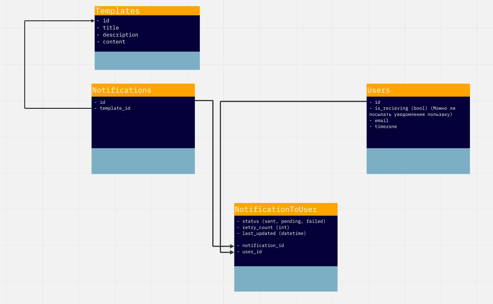

# Проектная работа 10 спринта

Проектные работы в этом модуле в команде. Задания на спринт вы найдёте внутри тем.

Ссылка на репозиторий - https://github.com/bogatovad/notifications_sprint_1

## Запуск
Создать и заполнить .env из .env.example в папке `envs`.  
Из этой же папки выполнить:
- `make build`

### Для создания суперпользователя:
make superuser

## Схема сервиса

## Схема БД

