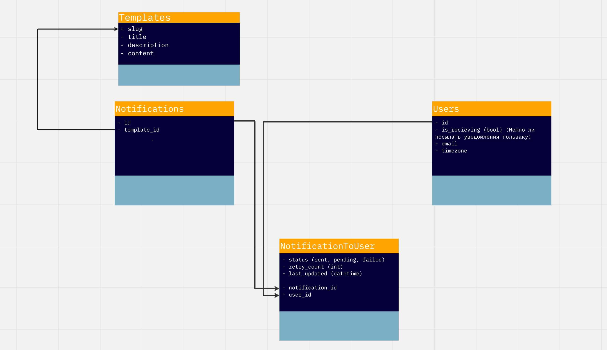
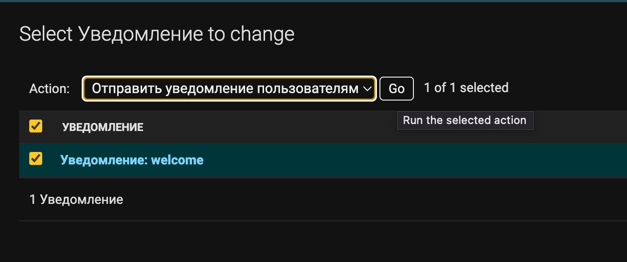

# Проектная работа 10 спринта

Проектные работы в этом модуле в команде. Задания на спринт вы найдёте внутри тем.

Ссылка на репозиторий - https://github.com/bogatovad/notifications_sprint_1


## Сборка и запуск
Создать и заполнить .env из .env.example в папке `envs`.  
Из корневой папки для сборки проекта выполнить:
- `make build`

Для запуска:
- `make up`

## Для создания суперпользователя:
- `make superuser`

## Схема сервиса


---

## Схема БД



### Поля таблиц БД.


#### Template
`slug` - PK шаблона  
`title` - Заголовок  
`description` - Описание  
`content` - Текст шаблона

#### Notification
`template` - FK на шаблон  
`name` - Название шаблона, определяет имя очереди, в которую полетит уведомление  
`type` - Тип рассылки (одиночная/групповая)   
`users` - Пользователи, кому отправляется рассылка  
`groups` - Группа пользователей для рассылки  

---
### Отправка уведомления из админки

Необходимо создать Template, далее создать Notification - выбрать шаблон, тип рассылки, пользователей и/или группу(-ы) пользователей.
Затем выделить нужное уведомление  и ввыпадающем окне выбрать "Отправить уведомление пользователям"


---

## Пример запроса для Notification Service
```
curl --location --request GET '127.0.0.1:8080/api/v1/send-notification/email' \
--header 'Content-Type: application/json' \
--header 'Cookie: csrftoken=mKjF1tJ1h0WVkk9XM99EP2MAqP8i8cdSDAmcEBVhFsSxuIXaS3ROG87umafmJqcF' \
--data '{
    "receiver": "9de57835-28b7-4cc7-be46-95a0fb1b17c1",
    "event_name": "welcome",
    "event_type": "welcome",
    "type": "personal",
    "context": {"title": "new_title"}
}'
```

- `receiver` - Один uuid в случае персональной рассылки или список uuid
- `event_name` - Название шаблона = Имя очереди
- `event_type` - Тип события 
- `type` - Тип рассылки (личная/групповая0
- `context` - Контекст для подстановки данных в шаблон 